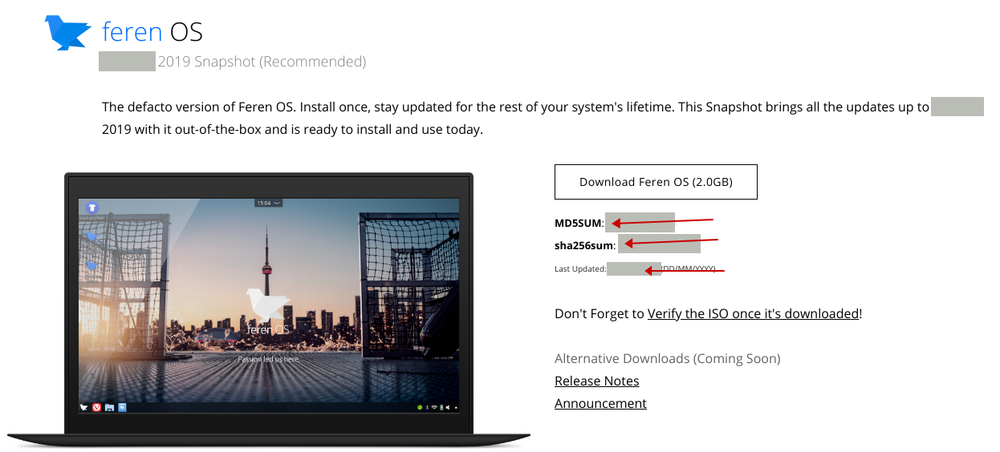
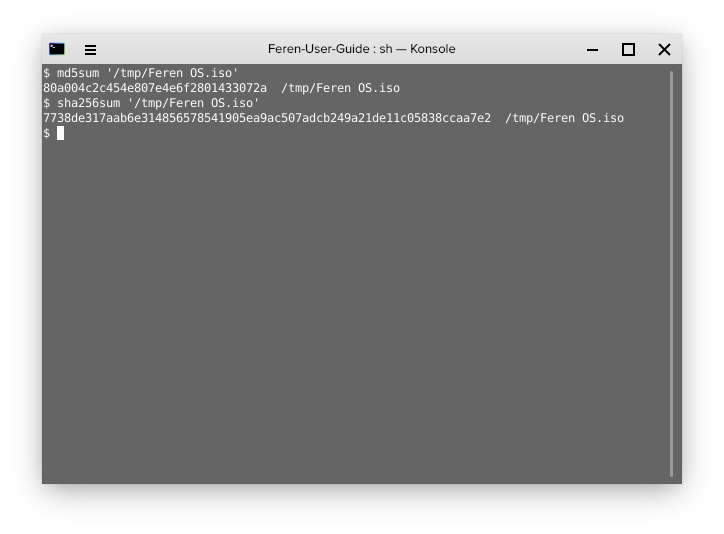

Verifying your Feren OS ISO
==================

Why would you verify a Feren OS ISO?
----------------

There are multiple reasons for wanting to verify your ISO. These reasons include:

- Making sure that the ISO you've downloaded is legitimate
- Making sure that the ISO has not been compromised in any sort of way
- Making sure that the ISO has not been corrupted in any way

If the ISO verification methods below reproduce different values to the ones on the website for these ISOs, please scrap that current ISO and redownload it to save yourself potential hassle in the future.

Techniques used to verify a Feren OS ISO
----------------

There are two checksums that are used to verify each Feren OS ISO: An MD5SUM and a SHA256SUM checksum. These checksums are unique for every ISO and every single version of the ISOs. Even small updates and snapshot updates to the ISOs result in a new MD5SUM and SHA256SUM.

Where can I get the MD5SUM and SHA256SUM?
----------------

Getting the MD5SUM and SHA256SUM checksum of your Feren OS ISO is simple. Go to the Feren OS download page that you obtained your ISO from and look on the right and under the 'Download' button of your chosen Feren OS version. You'll see the MD5SUM and SHA256SUM below the button for your ISO. You can then proceed to check if your ISO's checksums match with the ones stated on the website.

``Feren OS Classic`` users will also want to be sure that the one they are checking is of the correct architecture.

Below is an example of the Get Feren OS page to demonstrate where you can get the data for verifying an ISO:

As you can see, there are three pieces of data: The MD5SUM of the ISO(s), the SHA256SUM of the ISO(s) and the date the ISO(s) was last updated. These are cruicial for the verification process.

How do I obtain the MD5SUM and SHA256SUM of the ISO?
-------------------------------------

Obtaining the MD5SUM and SHA256SUM of the ISO you've downloaded is easy.

For Linux and Feren OS you can just open up ``Terminal`` and type the following command, a space and then drag and drop the downloaded ISO into the Terminal window: ``md5sum``

The process may take a while, however once it is done the MD5SUM of the ISO you've downloaded will be outputted.

The same applies for a SHA256SUM, with the command being ``sha256sum`` instead for getting the SHA256SUM of the ISO file.

For other platforms such as Windows or macOS you can use an MD5SUM generator on the internet and a SHA256SUM generator on the internet to check these checksums. There are plenty of these available around the internet, so take your pick.

MD5SUM Generator Example: https://emn178.github.io/online-tools/md5_checksum.html
SHA256SUM Generator Example: https://emn178.github.io/online-tools/sha256_checksum.html

How do I verify the Feren OS ISOs using these checksums?
-------------------------------------

Once you've got the checksums, simply just check if they are the exact same as the one on the website for your ISO. If they are the exact same, the ISO verification process was a success, otherwise the ISO verification process was a failure.
