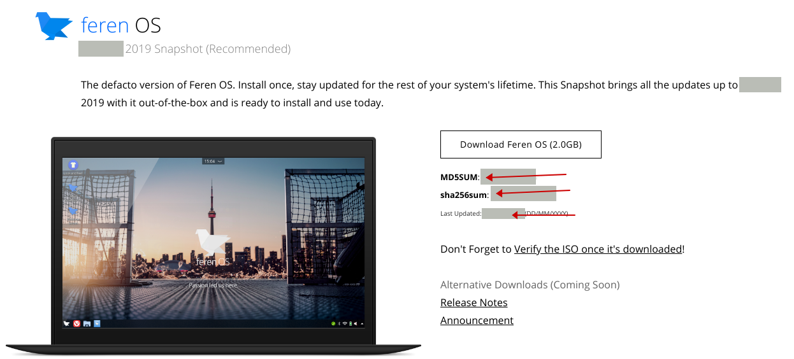
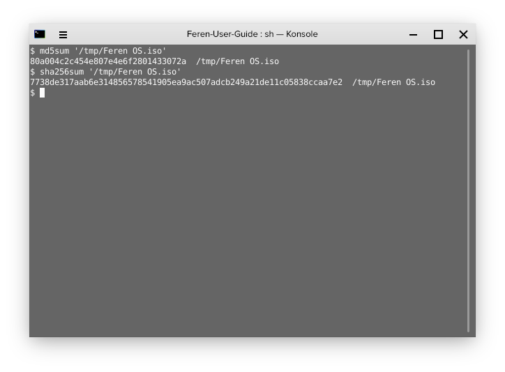

Verifying your Feren OS download
==================

Why would you verify your Feren OS download?
----------------

There are multiple reasons, including:

* Making sure that your copy is legitimate
* Making sure that your copy has not been compromised in any sort of way
* Making sure that your copy has not been corrupted in any way

If any verification methods below reproduce different values to the ones on the website for Feren OS, please purge that current '.iso' and redownload it to save yourself potential hassle in the future.

Techniques used to verify your Feren OS download
----------------

There are two checksums that are used to verify each Feren OS download: An MD5SUM and a SHA256SUM checksum. These checksums are unique for every version of Feren OS - even small refresh updates to the Feren OS download result in a new MD5SUM and SHA256SUM.

Where can I get the MD5SUM and SHA256SUM?
----------------

Getting the MD5SUM and SHA256SUM checksum of your Feren OS download is simple. Go to the Feren OS download page and look on the right under the 'Download' button - you'll see the MD5SUM and SHA256SUM below the button. You can then proceed to check if your download's checksums match with the ones stated on the website.

Below is an example of the Get Feren OS page to demonstrate where you can get the data for verifying Feren OS:

As you can see, there are three pieces of data: The MD5SUM, the SHA256SUM and the date the Feren OS download was last updated. These are crucial for the verification process.

How do I obtain the MD5SUM and SHA256SUM of my Feren OS download?
-------------------------------------

Obtaining your Feren OS download's MD5SUM and SHA256SUM is easy.

For Linux and Feren OS you can just open up ``Konsole`` and type the following command, a space and then drag and drop your Feren OS download into the Konsole window: ``md5sum``

The process may take a while, however once it is done the MD5SUM of the ISO you've downloaded will appear in a new line below the command.

The same applies for a SHA256SUM, with the command being ``sha256sum`` instead for getting the SHA256SUM of your Feren OS download.

For other platforms such as Windows or macOS you can use an MD5SUM generator on the internet and a SHA256SUM generator on the internet to check these checksums. There are plenty of these available around the internet, so take your pick.

MD5SUM Generator Example: https://emn178.github.io/online-tools/md5_checksum.html
SHA256SUM Generator Example: https://emn178.github.io/online-tools/sha256_checksum.html

Next Steps
-------------------------------------

* `Flashing to a USB Stick <https://feren-os-user-guide.readthedocs.io/en/latest/flashtousb.html>`_
* `Burning to a DVD <https://feren-os-user-guide.readthedocs.io/en/latest/burntodvd/index.html>`_
