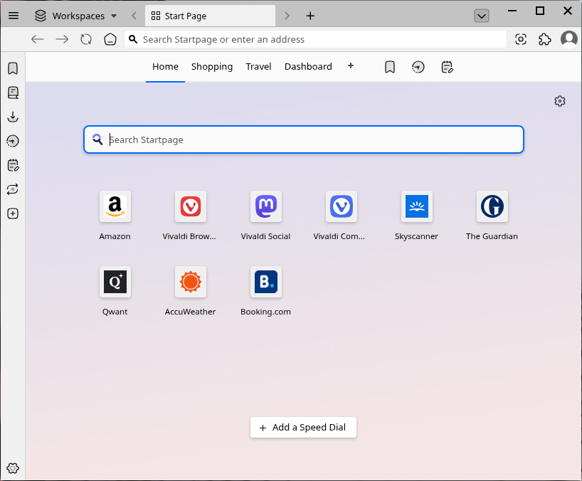

Vivaldi
==================

Vivaldi is the default browser in Feren OS, although you can change it at any time via the `Web Browser Manager <https://feren-os-user-guide.readthedocs.io/en/latest/browsermanager.html>`_.

Using Vivaldi is quite simple - in Feren OS Vivaldi is lightly pre-configured to add custom Feren OS themes, apply compact mode, add a shortcut to the :guilabel:`Capture Page` function to the toolbar, pre-install the Plasma Integration extension to add deeper integration with Feren OS, and remove some confirmation popups by default that may annoy users.

Feel free to explore Vivaldi as you see fit, and keep in mind it supports extensions from the Chrome Web Store.

    Vivaldi in Feren OS

Getting help with Vivaldi
---------------

If you need help with Vivaldi, you can find help on these websites:

- `Official Vivaldi Help Page <https://help.vivaldi.com/>`_

Using the unmodified Vivaldi experience
---------------

If you are a purist or just want to use Vivaldi without any of the changes made in Feren OS, you can easily get an unmodified Vivaldi up and running with these steps:

1. Click the person icon on the top-right

2. Click :guilabel:`Manage People...` in the menu that appears

3. Click :guilabel:`Add Person` twice

4. A new Vivaldi window will pop up. Close the previous Vivaldi window

5. In this new Vivaldi window click the person icon on the top-right again

6. Click :guilabel:`Manage People...` again

7. Click :guilabel:`Person 1` (or whatever you named the old profile if you changed its name)

8. Click :guilabel:`Remove Person`

.. warning::
    Once you remove :guilabel:`Person 1`, this operation cannot be undone without completely reimporting the Vivaldi configuration from :menuselection:`File System --> etc --> skel` manually which will completely reset Vivaldi back to its initial Feren OS state.