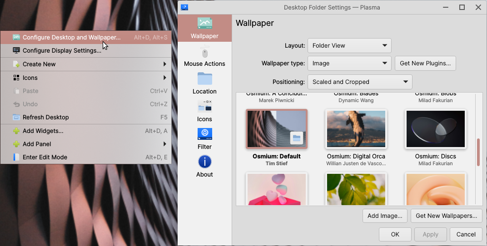
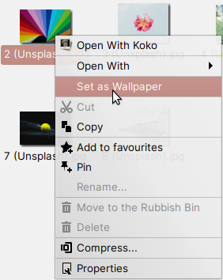

Change the wallpaper
==================

The wallpaper is the image on your Desktop. To change the wallpaper, you can:

Right-click the Desktop
-------------------------------------

Right-click the Desktop, then select :guilabel:`Configure Desktop and Wallpaper...` to open the wallpaper selector.

Launch from System Settings
-------------------------------------

Open System Settings, then in Quick Settings click :guilabel:`Change Wallpaper...` to open the wallpaper selector.

Set an image as the wallpaper
-------------------------------------

Finally, if you're browsing images in Files, you can set the wallpaper directly from Files by right-clicking the image you want to use as your wallpaper and selecting :guilabel:`Set as Wallpaper`.

