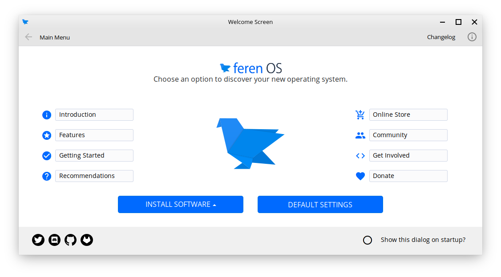

Welcome Screen
==================

What is the Welcome Screen?
----------------

The Welcome Screen is a utility built in to Feren OS that guides you through a few handy tips, things to do and more to introduce and help get you familiar with Feren OS. You can use it to get an introduction to what Feren OS is, some extra tips on Getting Started, and more. You can access it via Applications Menu --> :guilabel:`System` --> :guilabel:`Welcome Screen` or via the shortcut on your Desktop.

    Welcome Screen

Introduction
----------------

The :guilabel:`Introduction` page tells you some facts about what Feren OS is, what makes Feren OS, Open Source technology and a few other related facts about Feren OS. Feel free to have a read-up if you'd like, though you might as well just skip over this page unless you seriously care about Feren OS enough.

Features
----------------

The :guilabel:`Features` page tells you some features that Feren OS has. Feel free to have a read-up if you'd like, though you might as well just skip over this page unless you seriously care about Feren OS enough.

Getting Started
----------------

The :guilabel:`Getting Started` page gives you some advice on the first things to do in Feren OS to get your machine set up better. It can be used as an extension of the User Guide to install and configure one or two extra items in Feren OS.

Recommendations
----------------

The :guilabel:`Recommendations` page gives you a few suggestions for programs to install in Feren OS to either add features to the user experience or provide you with easier ways to do tasks in Feren OS such as gaming. Check the page out if you want some ideas for applications to install on your new Feren OS installation.

Community
----------------

The :guilabel:`Community` page is a great place for getting quick access to Feren OS on Social Media as well as some forums, etc that may support Feren OS users as well.

Get Involved
----------------

The :guilabel:`Get Involved` page tells you ways in which you can help support Feren OS grow, join the community, and help contribute to the future of Feren OS. You will also find links to the Feren OS GitHub there as well as a few upstream links.

Install Software
----------------

The :guilabel:`Install Software` button gives you two options for installing applications, being through the Store for classic packages and Flatpaks or the "Snap Store" for Snaps.

Classic Packages are archives containing whole applications or other parts of the inner-workings of Feren OS or the applications installed on it packaged up in an archive format and extracted onto your system when installed.

Flatpaks are an alternative to Classic Packages that provide more guaranteed security (most of the time) as well as generally being more up-to-date than Classic Packages or exclusively Flatpaks.

Snaps are very similar to Flatpaks, except Snaps can all be obtained from a single repository owned by the creators of Snap (Canonical). The Snap Store may also have a few Snap-only exclusives in rare cases.

Changelog
----------------

The :guilabel:`Changelog` page is a good page for finding out the changes made in the current snapshot of Feren OS since the release of the previous snapshot of Feren OS was released.

.. hint::
    'Snapshot' refers to updates done to all the Feren OS ISO files during a 3-month release cadence (unless a snapshot has to be delayed). This page will appear automatically every time a new Feren OS snapshot is made unless the toggle on that page is switched off.

Default Settings
----------------

Finally, the :guilabel:`Default Settings` button takes you to a page where you can reset your theme and layout back to the default settings in case you ever mess up the themeing or your desktop layout and want an easy way to undo your changes quickly.