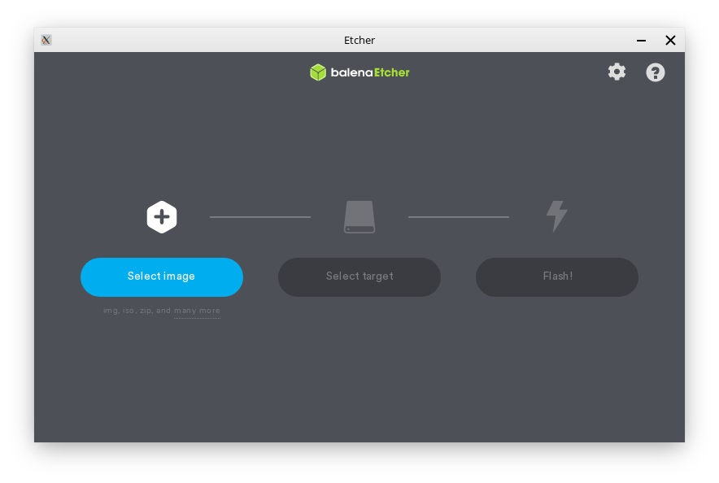

Writing the ISO to a USB Stick
==================

Getting the necessary tools
----------------

Before you can flash your newly downloaded Feren OS ISO file to a USB Stick, you'll need a program called ``balenaEtcher`` to flash your Feren OS ISO file to a USB of your choosing.

You can get balenaEtcher for your machine at https://www.balena.io/etcher/

.. hint::
    If you are unsure about which version of balenaEtcher should be downloaded between a 64-bit download and a 32-bit download, refer to `Getting the correct Feren OS for your machine <https://feren-os-user-guide.readthedocs.io/en/latest/getcorrectferenos.html>`_ to find out which architecture your machine uses and therefore which balenaEtcher to download.

Once you have downloaded balenaEtcher for your platform, set it up so that you see a window similar to the one shown in the image above.

.. hint::
    For Linux (and Feren OS) you will want to make the .AppImage file that you downloaded executable in its properties (right-click the balenaEtcher .AppImage file --> Properties --> Permissions) so that you can open the file normally.
    For Windows you will need to install balenaEtcher first unless you have downloaded the portable version instead.

Flashing your Feren OS ISO file to your USB
-------------------------------------

Now for the part where you get Feren OS flashed. To flash Feren OS to a USB:

.. warning::
    If you have data on the USB drive you want to flash Feren OS onto, back it up elsewhere or else it will be permanently lost when you flash your Feren OS ISO file onto it.

1. Plug in your USB

2. Open balenaEtcher

3. Click :guilabel:`Select image` and select the Feren OS ISO file you downloaded

4. Click :guilabel:`Select target` and select your USB and then hit Continue

5. Click :guilabel:`Flash!` and authenticate if required

This process may take a while, but once you are done you can move on to the next step:

* `Making preparations in Windows <https://feren-os-user-guide.readthedocs.io/en/latest/prepwindows.html>`_
* `Making preparations in macOS <https://feren-os-user-guide.readthedocs.io/en/latest/prepmacos.html>`_
* `Making preparations in Linux <https://feren-os-user-guide.readthedocs.io/en/latest/preplinux.html>`_